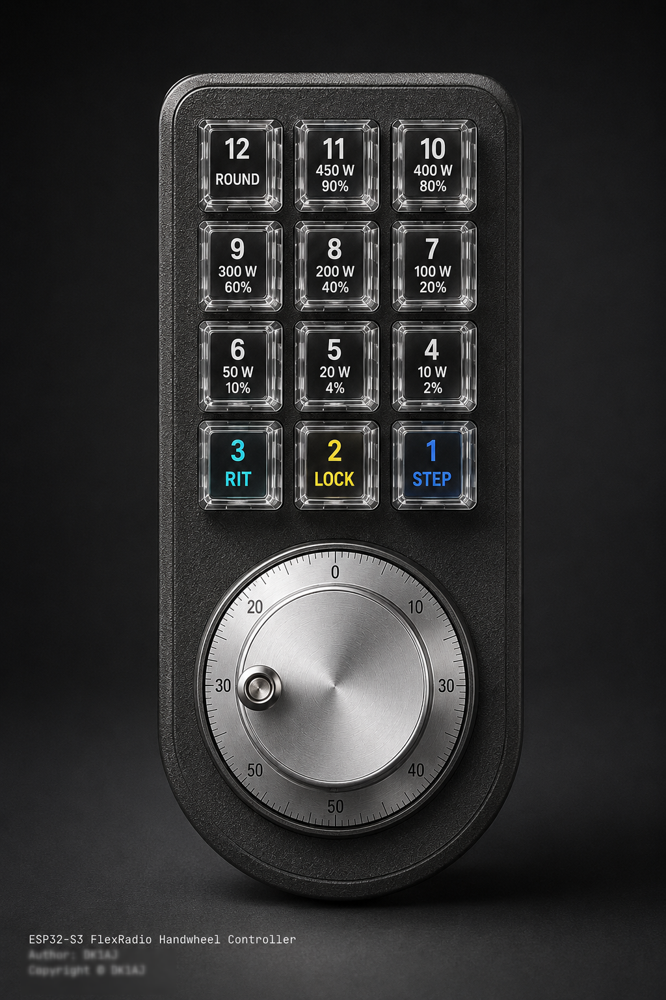

# ESP32-S3 Radio Handwheel Controller

Firmware for an ESP32-S3 handwheel with a 3x4 Adafruit NeoKey keypad.
It controls one SmartSDR-compatible Radio over Wi-Fi and requires exactly one active Slice; no FRStack or PC is needed.

## Features

- Hardware quadrature decoding with the ESP32-S3 PCNT peripheral
- Nine encoder tuning steps from 1 Hz to 1 kHz
- Twelve debounced keys with NeoPixel feedback
- Direct UDP discovery and SmartSDR TCP control
- Fixed-IP fallback, keepalive, and automatic reconnect
- Eight HF RF-power presets; all power keys are disabled on 6 metres
- Captive Wi-Fi setup portal and serial diagnostics at 115200 baud

## Controls

- Encoder: tune the selected Slice by one configured step per detent
- Key 1: cycle steps; double-click selects 50 Hz; long press selects 100 Hz
- Keys 2 and 3: no action
- Keys 4 to 11: request 2, 4, 10, 20, 40, 60, 80, or 90 percent RF power
- Key 12: round the selected Slice frequency to the nearest full kHz

## Hardware

- Board: ESP32-S3-WROOM-1-N16R8 DevKitC-1, 16 MB flash and 8 MB PSRAM
- Encoder: GPIO4/GPIO5; NeoKey columns: GPIO2/42/41; rows: GPIO40/39/38/47
- NeoKey data: GPIO21; connection-status RGB LED: GPIO48
- Use 3.3 V logic and common ground; GPIO35 to GPIO37 are reserved by PSRAM
- Parts list: [BOM](DOKU/BOM_CNC_Rotary_Macropad.txt)

## Build and setup
`pio run -e esp32-s3-n16r8` · `pio run -e esp32-s3-n16r8 -t upload` · `pio device monitor -b 115200`
Copy `include/WifiSecrets.example.h` to the ignored `include/WifiSecrets.local.h`.
If no usable credentials exist, connect to `ESP32-Radio-Setup` and open `http://192.168.4.1`.

The firmware builds successfully, but transport hardening and full hardware regression testing remain open.
Detailed planning and test history are kept locally and excluded from public releases.
