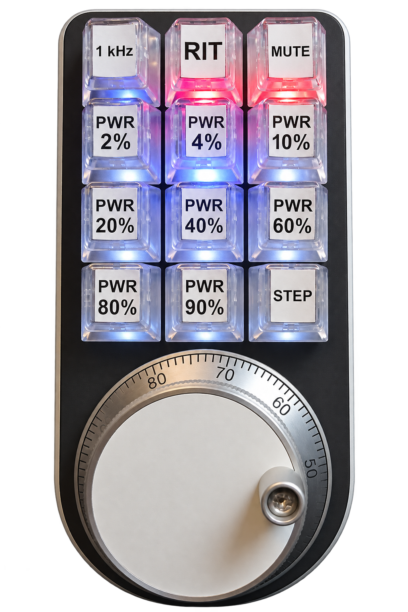

# ESP32 FlexControl

ESP32 FlexControl is a self-contained radio handwheel built around a Seeed Studio XIAO ESP32S3, a CNC rotary encoder, and a 3x4 Adafruit NeoKey keypad. It controls one compatible FlexRadio directly over the local Wi-Fi network.

## Project status

Project status: Completed

The final firmware and controller hardware, including controls, lighting, Wi-Fi, Radio communication, failure handling, and reconnect behavior, have passed the completed hardware regression.

## Final build



The pictured controller is the completed and tested hardware version.

## Features

- Direct SmartSDR TCP/IP control without a PC-side service, with discovery, static fallback, keepalive, and reconnect.
- Hardware-quadrature tuning and twelve fixed keypad functions for tuning, RIT, mute, and RF power.
- Strict action safety based on exactly one active, frequency-known Slice.
- Captive Wi-Fi setup with persistent credentials and key lighting for interaction and confirmed Radio state.

## Hardware

- Seeed Studio XIAO ESP32S3.
- Adafruit NeoKey 5x6 Ortho Snap-Apart PCB used as one 3x4 section.
- Twelve MX-compatible switches and keycaps plus an Adafruit 100-pulse-per-revolution CNC rotary encoder.
- One 15-pixel NeoPixel chain on the NeoKey assembly.
- 3.3 V logic and a common ground for all external signals.

See the [bill of materials](DOKU/BOM_CNC_Rotary_Macropad.txt) for the final parts list.

## GPIO and wiring

| Function | XIAO pin | GPIO |
| --- | --- | --- |
| Encoder A | D0 | GPIO1 |
| Encoder B | D1 | GPIO2 |
| NeoKey columns 1 / 2 / 3 | D2 / D3 / D4 | GPIO3 / GPIO4 / GPIO5 |
| NeoKey rows 1 / 2 / 3 / 4 | D5 / D6 / D7 / D8 | GPIO6 / GPIO43 / GPIO44 / GPIO7 |
| NeoKey NeoPixel data | D9 | GPIO8 |
| Free header pin | D10 | GPIO9 |
| Onboard status LED | onboard | GPIO21, active-low |

GPIO3 is deliberately used for column 1 despite being an ESP32-S3 strapping pin. Native USB uses internal GPIO19 and GPIO20.

## Encoder

The encoder uses ESP32 PCNT x4 quadrature decoding with four counts per detent. Its signed 64-bit position preserves partial detents and uses the configured hardware glitch filter. Clockwise rotation tunes upward.

Key 1 selects 1, 5, 10, 20, 50, 100, 250, 500, or 1000 Hz per detent. A double-click selects 50 Hz and a long press selects 100 Hz.

## Keypad and buttons

Keys are numbered row-wise from top-left to bottom-right: `1 2 3 / 4 5 6 / 7 8 9 / 10 11 12`.

- Key 1 selects the encoder tuning step; key 2 toggles RIT; key 3 toggles Slice audio mute.
- Keys 4-11 request RF power of 2, 4, 10, 20, 40, 60, 80, or 90 percent.
- Key 12 rounds the active Slice to the nearest kHz; 500 Hz rounds upward.
- Holding keys 1 and 12 together for two seconds opens the setup portal.

The matrix is scanned every 1 ms with 3 us settling and 20 ms per-key debounce.

## Wi-Fi

Valid stored portal credentials take priority over compiled fallback credentials in `include/WifiSecrets.local.h`. If neither connects within 20 seconds, the controller starts the English `ESP32-Radio-Setup` portal at `http://192.168.4.1`.

Portal updates use a versioned dual-slot record with staged activation. A failed update preserves the last valid record. Stored credentials can be replaced or deliberately erased without printing passwords to Serial.

## FlexRadio communication

The controller listens for Radio discovery on UDP port 4992. After five seconds without discovery, it falls back to `192.168.178.70:4992`.

Control uses a direct SmartSDR TCP session with subscriptions, bounded command tracking, keepalive, timeout handling, and reconnect. SmartSDR or AetherSDR may be used separately. USB is for firmware upload and diagnostics, not FlexRadio control.

Every action requires exactly one Slice reporting `active=1` and a known frequency. RF-power commands are blocked from 50 through 54 MHz inclusive. Confirmation requires an accepted response and matching fresh status; no power command is sent automatically at startup or reconnect.

## Status indication

- Keys have dim background lighting; a press flashes green, a held key blinks red, and release fades to rest.
- Enabled RIT and mute states make keys 2 and 3 glow dim red.
- A pending RF-power key blinks blue and a confirmed preset stays blue.
- Radio connection starts a green animation down keys 1, 4, 7, and 10; unused NeoPixels 12-14 remain off.
- The active-low GPIO21 LED blinks during connection work and stays on once the Radio TCP session is connected or ready.

## Configuration

Copy `include/WifiSecrets.example.h` to the ignored `include/WifiSecrets.local.h` for optional compiled fallback credentials.
The static Radio fallback is defined in `include/RadioConfig.h`.
Upload and monitoring are fixed to `COM12` in `platformio.ini`.

## Building

The project has one PlatformIO environment: `xiao-esp32-s3`.

```text
pio run -e xiao-esp32-s3
pio run -e xiao-esp32-s3 -t upload
pio device monitor -p COM12 -b 115200
```

## Usage

Power the controller, allow it to join Wi-Fi and connect to the Radio, then use the encoder and fixed keys. Radio actions are accepted only while the session and exactly one active Slice are ready.

## Project images

[Controller product render](DOKU/handwheel-product-render.png) |
[Control overview](DOKU/handwheel-control-overview.png) |
[Control layout sketch](DOKU/handwheel-control-sketch.png)

## Project completion

The project is completed. Version `v1.0.0` identifies the final tested hardware and firmware release.
